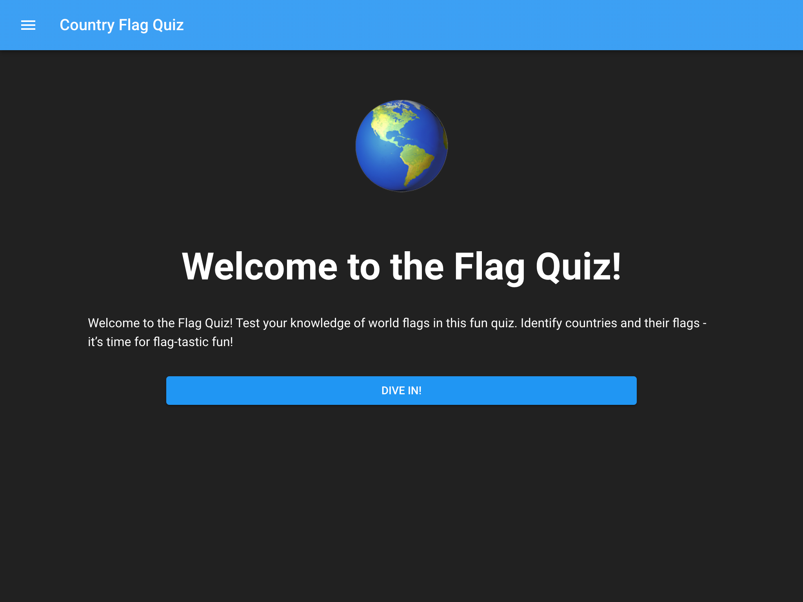

# Country Flag Quiz App

<div align="center">
  
</div>

Welcome to Country Flag Quiz, a web application built with Next.js that tests your knowledge of national flags! This interactive quiz app is designed to challenge and educate users about flags from around the world.

## Features

- **Flag Quiz:** Test your knowledge by identifying flags from different countries.
- **Flag List:** Explore a comprehensive list of national flags for reference and learning purposes.

## Preview

- [https://main.d3oi4d7f6g0q3z.amplifyapp.com/](https://main.d3oi4d7f6g0q3z.amplifyapp.com/)

## Getting Started

### Prerequisites

Make sure you have Node.js and npm installed on your machine.

### Installation

1. Clone the repository:

   ```bash
   git clone https://github.com/aq41571/country-flag-quiz
   ```

2. Navigate to the project directory:

   ```bash
   cd country-flag-quiz
   ```

### Running the App

Start the Next.js development server:

```bash
npm run dev
```

Open your browser and visit [http://localhost:3000](http://localhost:3000) to access the Country Flag Quiz app.

## Contributing

Contributions are welcome! If you have ideas for new features, bug fixes, or improvements, feel free to open an issue or submit a pull request.

## License

This project is licensed under the MIT License.
